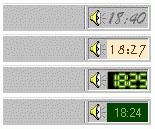

## Cool Clock \- A \*skineable\* substitution for your system tray clock\!

### Description

Cool Clock is the first ever skinnable substitution for your old System Tray clock!

You can use a *GRAPHICAL* skin, or set the background color, text color and font name/size for a text-based (yet cool if you use the right font) skin!

This is based on the System Tray Status Bar code sample (if you know the name of the person that did this, posted a few days ago, please leave a comment here!), but I did the text/image skins system and all the rest (including the default - and only :( - skin included).

If you want it to appear every time you log on to Windows, make a shortcut for it in your "Start\Programs\Startup" folder.

It's also a must to include with every desktop theme you make (I don't mind as long as my name remains there), to customize Windows even more and impress the users!

And if you have any more skins you make, please send them to me and they'll be posted here along with your name ;)
 
### More Info
 

             |
---                |---
**Submitted On**   |2000-12-02 17:37:28
**By**             |[Jotaf98](https://github.com/Planet-Source-Code/PSCIndex/blob/master/ByAuthor/jotaf98.md)
**Level**          |Intermediate
**User Rating**    |4.8 (43 globes from 9 users)
**Compatibility**  |VB 4\.0 \(16\-bit\), VB 4\.0 \(32\-bit\), VB 5\.0, VB 6\.0
**Category**       |[Complete Applications](https://github.com/Planet-Source-Code/PSCIndex/blob/master/ByCategory/complete-applications__1-27.md)
**World**          |[Visual Basic](https://github.com/Planet-Source-Code/PSCIndex/blob/master/ByWorld/visual-basic.md)
**Archive File**   |[CODE\_UPLOAD122681222000\.zip](https://github.com/Planet-Source-Code/jotaf98-cool-clock-a-skineable-substitution-for-your-system-tray-clock__1-13269/archive/master.zip)

